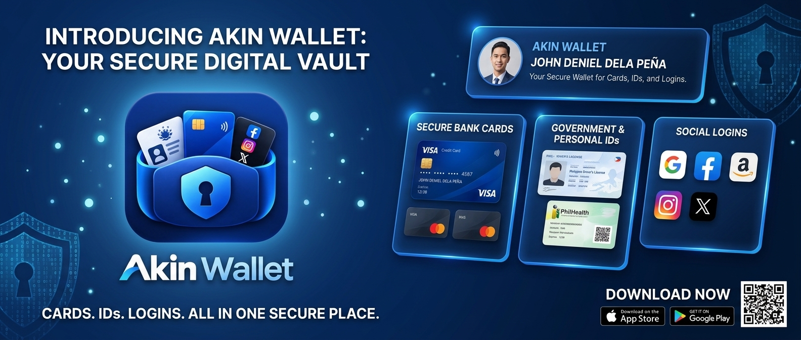

# Akin Wallet

> **CARDS. IDs. LOGINS. ALL IN ONE SECURE PLACE.**
>
> Your Secure Digital Vault for Cards, IDs, and Logins.

Akin Wallet is a **100% offline, private-first Android digital wallet** for identity cards, bank cards, and social logins. No account, no cloud, no tracking — all data stays on your device in a local SQLite database.

## Features

- **Secure Bank Cards** — Store VISA, Mastercard, and other payment cards with masked numbers and expiry tracking
- **Government & Personal IDs** — Keep driver's licenses, PhilHealth, and other personal ID cards organized (e.g. ID number, info, QR)
- **Social Logins** — Save and organize logins for Google, Facebook, Instagram, X, TikTok, GitHub, Gmail, Discord, Spotify, YouTube, Reddit, LinkedIn, Snapchat, Telegram, WhatsApp, and more
- **Linked / Associated Accounts** — Link related accounts together
- **Search & Manage** — Fast search across IDs, cards, and logins with add / edit / delete, show-hide, and copy
- **Native Android UI** — Material UI with bottom navigation: IDs | Bank Cards | Social

## 100% Offline & Private

- **No `INTERNET` permission** in `AndroidManifest.xml` — the app cannot access the network
- **Local-only storage** in `akin_wallet.db` via `SQLiteOpenHelper` (`AppDatabaseHelper.java`)
  - `logins` table: platform, username, password, pin, icon
  - `associations` table: linked accounts
- **No analytics, no ads, no cloud sync, no account required**
- Uninstall = data wiped. Back up your device if needed.

## Tech Stack

- Native Android (Java 11)
- AndroidX: AppCompat, ConstraintLayout, Material
- SQLite (`android.database.sqlite`)
- Min SDK 24, Target / Compile SDK 37
- Gradle Version Catalog (`gradle/libs.versions.toml`)